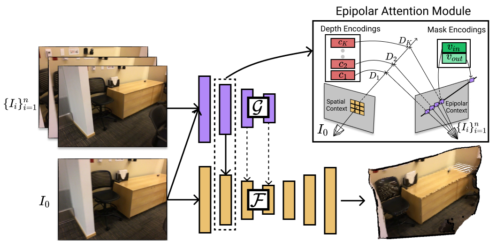

# MVS2D: Efficient Multi-view Stereo via Attention-Driven 2D Convolutions

### [Project Page](https://zhenpeiyang.github.io/MVS2D/) | [Paper](https://arxiv.org/abs/2104.13325)
<br/>



If you find our work useful for your research, please consider citing our paper:

```bibtex
@article{DBLP:journals/corr/abs-2104-13325,
  author    = {Zhenpei Yang and
               Zhile Ren and
               Qi Shan and
               Qixing Huang},
  title     = {{MVS2D:} Efficient Multi-view Stereo via Attention-Driven 2D Convolutions},
  journal   = {CoRR},
  volume    = {abs/2104.13325},
  year      = {2021},
  url       = {https://arxiv.org/abs/2104.13325},
  eprinttype = {arXiv},
  eprint    = {2104.13325},
  timestamp = {Tue, 04 May 2021 15:12:43 +0200},
  biburl    = {https://dblp.org/rec/journals/corr/abs-2104-13325.bib},
  bibsource = {dblp computer science bibliography, https://dblp.org}
}
```

## ✏️ Changelog
### Nov 27 2021
* Initial release. Note that our released code achieve improved results than those reported in the initial arxiv pre-print. In addition, we include the evaluation on DTU dataset. We will update our paper soon. 

## ⚙️ Installation
<details>
  <summary>Click to expand </summary>

The code is tested with CUDA10.1. Please use following commands to install dependencies: 

```
conda create --name mvs2d python=3.7
conda activate mvs2d

pip install -r requirements.txt
```

The folder structure should looks like the following if you have downloaded all data and pretrained models. Download links are inside each dataset tab at the end of this README.  
```
.
├── configs
├── datasets
├── demo
├── networks
├── scripts
├── pretrained_model
│   ├── demon
│   ├── dtu
│   └── scannet
├── data
│   ├── DeMoN
│   ├── DTU_hr
│   ├── SampleSet
│   ├── ScanNet
│   └── ScanNet_3_frame_jitter_pose.npy
├── splits
│   ├── DeMoN_samples_test_2_frame.npy
│   ├── DeMoN_samples_train_2_frame.npy
│   ├── ScanNet_3_frame_test.npy
│   ├── ScanNet_3_frame_train.npy
│   └── ScanNet_3_frame_val.npy
```

</details>


## 🎬 Demo
<details>
  <summary>Click to expand </summary>
  
After downloading the pretrained models for __ScanNet__, try to run following command to make a prediction on a sample data. 
```
python demo.py --cfg configs/scannet/release.conf
```
 

The results are saved as demo.png

</details>

## ⏳ Training & Testing

We use 4 Nvidia V100 GPU for training. You may need to modify 'CUDA_VISIBLE_DEVICES' and batch size to accomodate your GPU resources.

### ScanNet
<details>
  <summary>Click to expand </summary>
  
#### Download
[__data__ 🔗](https://drive.google.com/file/d/1cyI62pHte8OofuuunrADbKnc8D_vATDF/view?usp=sharing)  [__split__ 🔗](https://drive.google.com/file/d/1nnCrW44CCy7w5g4pjfc_jlPPG_SIUqMi/view?usp=sharing)      [__pretrained models__ 🔗](https://drive.google.com/file/d/1NW_NaW3Wtwtx5N4jlAGL-o9s0TfWWFqi/view?usp=sharing) [__noisy pose__ 🔗](https://drive.google.com/file/d/10BXN8QEI_BBwoL6Yw3vq-c5ZuWNICxq_/view?usp=sharing) 
  
#### Training
First download and extract ScanNet training data and split. Then run following command to train our model. 
```
bash scripts/scannet/train.sh
```
To train the multi-scale attention model, add ```--robust 1``` to the training command in ```scripts/scannet/train.sh```. 

To train our model with noisy input pose, add ```--perturb_pose 1``` to the training command in ```scripts/scannet/train.sh```.

#### Testing 
First download and extract data, split and pretrained models.

Then run:
```
bash scripts/scannet/test.sh
```
You should get something like these:

| abs_rel | sq_rel | log10 | rmse  | rmse_log | a1    | a2    | a3    | abs_diff | abs_diff_median | thre1 | thre3 | thre5 |
|---------|--------|-------|-------|----------|-------|-------|-------|----------|-----------------|-------|-------|-------|
| 0.059   | 0.016  | 0.026 | 0.157 | 0.084    | 0.964 | 0.995 | 0.999 | 0.108    | 0.079           | 0.856 | 0.974 | 0.996 |
</details>

### SUN3D/RGBD/Scenes11
<details>
  <summary>Click to expand </summary>
  
#### Download
[__data__ 🔗](https://drive.google.com/file/d/1rCq41bM15tNaUJgdLbD4SsZxaeUbTtjJ/view?usp=sharing)  [__split__ 🔗](https://drive.google.com/file/d/1YgthIWcVW3ckMQH3f_gRsxQU1FT45k-3/view?usp=sharing)     [__pretrained models__ 🔗](https://drive.google.com/file/d/1xlh7qbosTiDwVA0bCYmAg18_UGs-H0u_/view?usp=sharing)    
  
#### Training 
First download and extract DeMoN training data and split. Then run following command to train our model. 

```
bash scripts/demon/train.sh
```

#### Testing 
First download and extract data, split and pretrained models.

Then run:
```
bash scripts/demon/test.sh
```
You should get something like these:

dataset rgbd: 160

| abs_rel | sq_rel | log10 | rmse  | rmse_log | a1    | a2    | a3    | abs_diff | abs_diff_median | thre1 | thre3 | thre5 |
|---------|--------|-------|-------|----------|-------|-------|-------|----------|-----------------|-------|-------|-------|
| 0.082   | 0.165  | 0.047 | 0.440 | 0.147    | 0.921 | 0.939 | 0.948 | 0.325    | 0.284           | 0.753 | 0.894 | 0.933 |

dataset scenes11: 256

| abs_rel | sq_rel | log10 | rmse  | rmse_log | a1    | a2    | a3    | abs_diff | abs_diff_median | thre1 | thre3 | thre5 |
|---------|--------|-------|-------|----------|-------|-------|-------|----------|-----------------|-------|-------|-------|
| 0.046   | 0.080  | 0.018 | 0.439 | 0.107    | 0.976 | 0.989 | 0.993 | 0.155    | 0.058           | 0.822 | 0.945 | 0.979 |

dataset sun3d: 160 

| abs_rel | sq_rel | log10 | rmse  | rmse_log | a1    | a2    | a3    | abs_diff | abs_diff_median | thre1 | thre3 | thre5 |
|---------|--------|-------|-------|----------|-------|-------|-------|----------|-----------------|-------|-------|-------|
| 0.099   | 0.055  | 0.044 | 0.304 | 0.137    | 0.893 | 0.970 | 0.993 | 0.224    | 0.171           | 0.649 | 0.890 | 0.969 |

-> Done!

depth

| abs_rel | sq_rel | log10 | rmse  | rmse_log | a1    | a2    | a3    | abs_diff | abs_diff_median | thre1 | thre3 | thre5 |
|---------|--------|-------|-------|----------|-------|-------|-------|----------|-----------------|-------|-------|-------|
| 0.071   | 0.096  | 0.033 | 0.402 | 0.127    | 0.938 | 0.970 | 0.981 | 0.222    | 0.152           | 0.755 | 0.915 | 0.963 |
</details>

### DTU
<details>
  <summary>Click to expand </summary>

#### Download
[__data__ 🔗](https://drive.google.com/file/d/1ritWQAUNeQTrzaQtt5TdJj2IDMN66ElM/view?usp=sharing)  [__eval data__ 🔗](https://utexas-my.sharepoint.com/:u:/g/personal/zy2974_austin_eid_utexas_edu/EVE_brgPP_hBrEdP1c0CjLMBiytR0kB9bnDsbeDudC8HdQ?e=HRjNxe)  [__eval toolkit__ 🔗](https://drive.google.com/file/d/1PH_P0kPVoaeFxFEKgBCWQ4EQiiqQeflX/view?usp=sharing)  [__pretrained models__ 🔗](https://drive.google.com/file/d/1vSsf5-X8_rxuW9ZkDaCJ3WwVmcaQbCfB/view?usp=sharing)   

#### Training 
First download and extract DTU training data. Then run following command to train our model. 

```
bash scripts/dtu/test.sh
```

#### Testing 
First download and extract DTU eval data and pretrained models.

The following command performs three steps together: 1. Generate depth prediction on DTU test set. 2. Fuse depth predictions into final point cloud. 3. Evaluate predicted point cloud. Note that we re-implement the original Matlab Evaluation of DTU dataset using python. 
```
bash scripts/dtu/test.sh
```

You should get something like these:

Acc  0.4051747996189477 <br />
Comp  0.2776021161518006 <br />
F-score  0.34138845788537414


#### Acknowledgement
The fusion code for DTU dataset is heavily built upon from [PatchMatchNet](https://github.com/FangjinhuaWang/PatchmatchNet)

</details>
